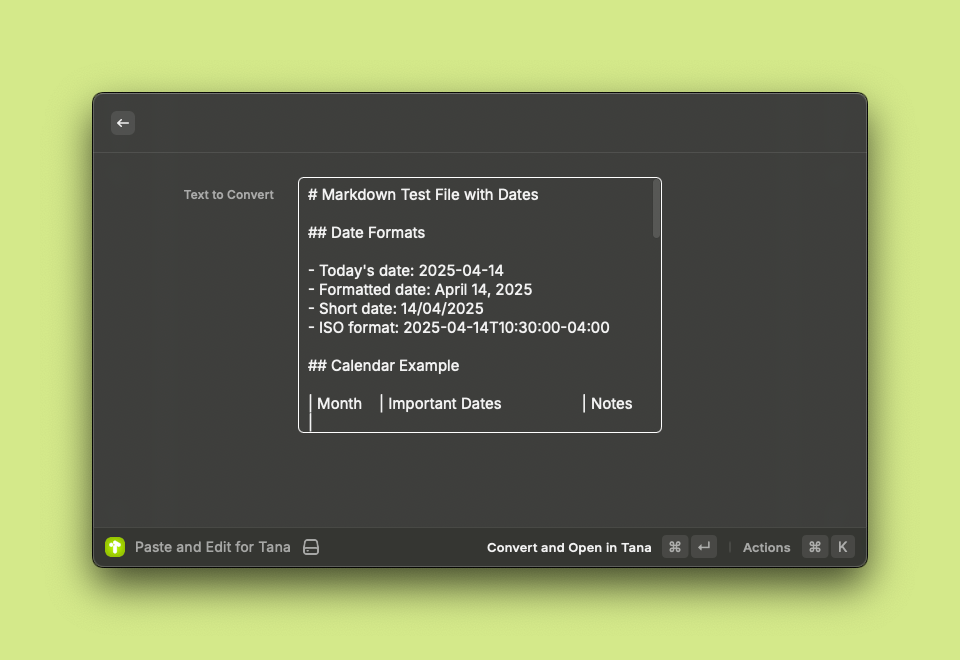
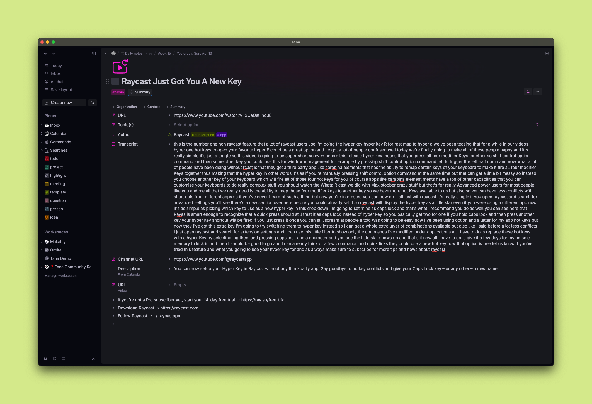

# Tana Tools for Raycast

Quickly convert text, Markdown, YouTube, and Limitless content to Tana Paste format—right from Raycast.

> **Note:** This is not an official Tana product. Made with nerd love by Lisa Ross. Suggestions welcome—open a GitHub issue or DM me on Slack!

## Features

- Convert clipboard or selected text to Tana Paste format
- Edit and preview before converting
- Extract and format YouTube video metadata and transcripts (with transcript chunking for large videos)
- Supports Limitless Pendant and Limitless App transcriptions
- Supports most Markdown transformations (headings, lists, paragraphs, nesting, etc.)
- Instant feedback via Raycast HUD
- If something isn't working as expected, please open an issue!

## Installation

1. Install [Raycast](https://raycast.com/)
2. Clone this repo and install dependencies:

   ```sh
   git clone https://github.com/lisaross/tana-tools-for-raycast.git
   cd tana-tools-for-raycast
   npm install
   ```

3. Build and start development:

   ```sh
   npm run build
   npm run dev
   ```

## Usage

- **Quick Clipboard to Tana:**
  1. Copy any text or Markdown to your clipboard (⌘+C).
  2. Open Raycast and run the "Quick Clipboard to Tana" command.
  3. The clipboard content is instantly scrubbed and converted to Tana Paste format.
  4. Paste into Tana (⌘+V).

- **Paste and Edit for Tana:**
  1. Copy any text or Markdown to your clipboard (⌘+C).
  2. Open Raycast and run the "Paste and Edit for Tana" command.
  3. The clipboard content appears in a Raycast window—edit as needed.
  4. Press Enter to convert and copy the edited text to Tana Paste format.
  5. Paste into Tana (⌘+V).
  6. Example window:

      
      *Example: Edit your clipboard content before converting to Tana Paste format*

- **Convert Selected Text to Tana:**
  1. Highlight text in any application (web page, document, etc.).
  2. Open Raycast and run the "Convert Selected Text to Tana" command.
  3. If the selection is from a website, the output will use the page title as the parent node and add the URL as the first child node.
  4. The selected text is converted to Tana Paste format and copied to your clipboard.
  5. Paste into Tana (⌘+V).

- **YouTube to Tana:**
  1. Go to a YouTube video page in your browser.
  2. Open Raycast and run the "YouTube to Tana" command (bonus: assign it a keyboard shortcut in Raycast Preferences for even faster access).
  3. Wait for the Raycast HUD notification confirming the result is ready.
  4. Paste into Tana (⌘+V) — the result will be formatted and chunked for Tana, including video title, URL, channel, description, and transcript.
  5. Example output:

      
      *Example: YouTube video transcript and metadata pasted into Tana*

- **Limitless Pendant/App:** Paste or select Limitless transcriptions and convert them to Tana Paste format.

Paste the result into Tana with ⌘+V.

## Example

**Input:**

```markdown
# My Heading
- List item
```

**Output:**

```
%%tana%%
- !! My Heading
  - List item
```

## Technical

- TypeScript, Raycast API v1.99.2
- Functional programming, strict typing, error handling

## Contributing

Contributions are welcome! Please feel free to submit a Pull Request.

## License

MIT License
